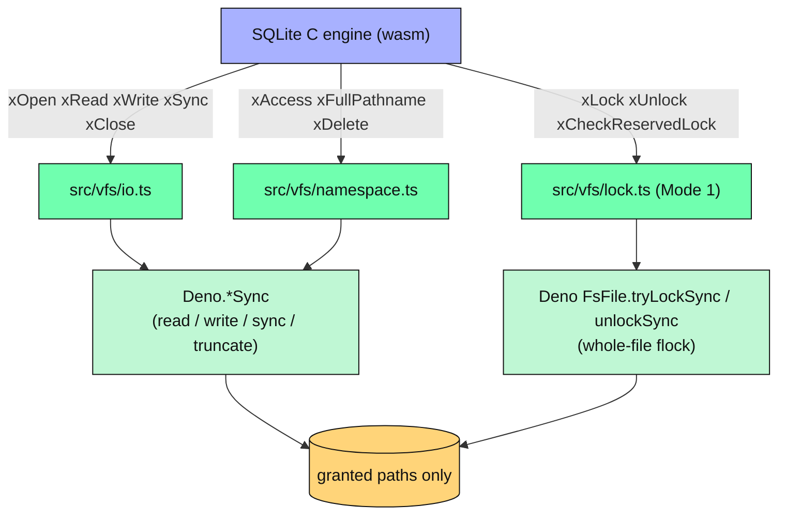
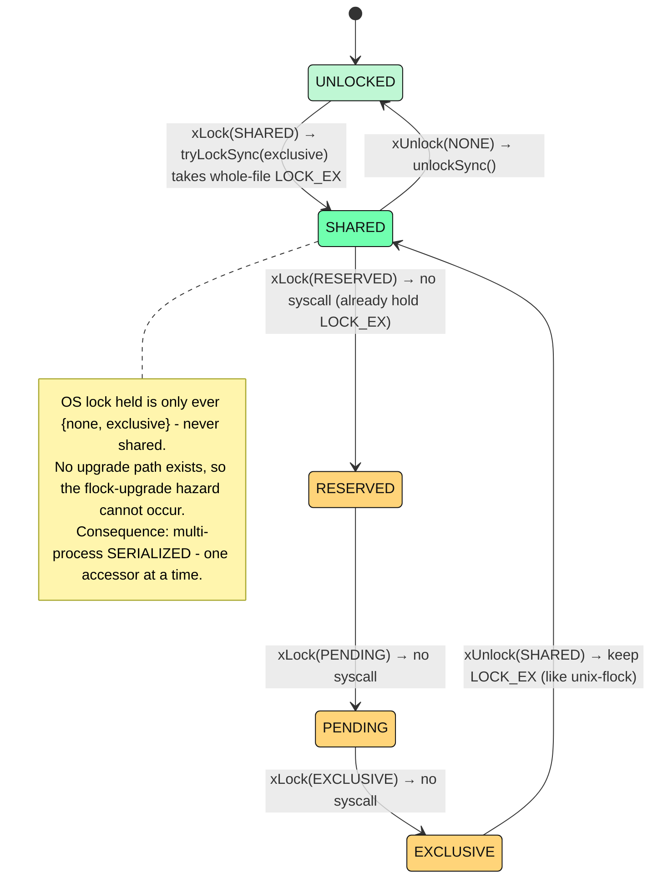
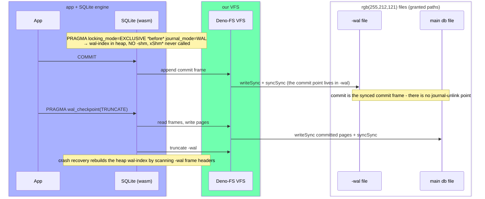

# Architecture

> The engineering depth behind sqlite-deno: how the VFS honors the permission grant, how the two
> concurrency modes work, what the crash/durability model proves, and why we ship the official wasm
> rather than compile our own. The [README](./README.md) is the product page; this is the "how and
> why."

**Intended reader:** someone evaluating the package's correctness claims, contributing to the VFS or
the harness, or curious how a permission-respecting SQLite is built without FFI.

**Prerequisites:** familiarity with SQLite's [VFS layer](https://www.sqlite.org/vfs.html), its
[locking model](https://www.sqlite.org/lockingv3.html), and [WAL](https://www.sqlite.org/wal.html)
helps but isn't required.

The decisions below reference internal ADRs by number (`DEC-001` … `DEC-013`). Those records are not
published; this document is the public home for what they decided and why.

---

## The shape of the thing

```
┌──────────────────────────────────────────────────────────────┐
│  Your code  →  public API: openDatabase, Database, Statement │
├──────────────────────────────────────────────────────────────┤
│  JS↔WASM glue (src/glue.ts): marshals values, owns memory    │
├──────────────────────────────────────────────────────────────┤
│  Official @sqlite.org/sqlite-wasm 3.53.0 (vendored, pinned)  │  ← the SQLite engine, unmodified
├──────────────────────────────────────────────────────────────┤
│  Deno-FS VFS (pure TypeScript, src/vfs/*)                    │  ← honors the grant
│     installed at runtime via sqlite3.vfs.installVfs          │
│     I/O → Deno.openSync / readSync / writeSync / tryLockSync │
└──────────────────────────────────────────────────────────────┘
```

Three facts shape everything:

- **No recompile.** We register a pure-TypeScript VFS against the _prebuilt_ official wasm via
  `installVfs`, the same mechanism SQLite's own browser OPFS VFS uses. v1 carries no C toolchain.
- **The VFS is simpler than the browser's.** OPFS is asynchronous but SQLite's VFS contract is
  synchronous, so the browser VFS needs a `SharedArrayBuffer` + `Atomics.wait` async-proxy dance to
  bridge them. Deno's file API is already synchronous (`openSync`, `readSync`, `writeSync`,
  `tryLockSync`), so our VFS calls Deno I/O directly: no `SharedArrayBuffer`, no `Atomics`, no
  proxy.
- **Runs everywhere Deno runs**, including Deno Deploy and the edge, by construction. One wasm,
  every target, no native binaries to build, sign, and re-download.

---

## The VFS and the permission grant

The wasm has **no ambient authority**. All of SQLite's I/O flows back out through our VFS callbacks,
and those reach the filesystem only through path-scoped `Deno.*Sync` calls. The module cannot open a
file the host did not hand it. This is the property that makes the whole package safe: if it were
supply-chain-compromised tomorrow, its blast radius would still be exactly the paths you granted.

The VFS code splits by responsibility:

| File                   | Responsibility                                                           |
| ---------------------- | ------------------------------------------------------------------------ |
| `src/vfs/io.ts`        | `sqlite3_io_methods`: read, write, sync, truncate on an open file handle |
| `src/vfs/namespace.ts` | `sqlite3_vfs` namespace ops: open, access, delete, full-pathname         |
| `src/vfs/lock.ts`      | the whole-file `flock` lock ladder (Mode 1)                              |
| `src/vfs/guard.ts`     | the canonicalize-then-recheck symlink guard (below)                      |

### VFS dispatch



_Legend: blue is the SQLite engine, green is our pure-TypeScript VFS, light green is the Deno host
API it calls, amber is the filesystem boundary that stays inside the granted paths._

Every VFS callback catches all errors and maps them to a SQLite result code (`SQLITE_IOERR`,
`SQLITE_CANTOPEN`, `SQLITE_BUSY`, …). A throw across into C is undefined behavior, so it is treated
as a bug, never an error path.

### I/O contract details

A few VFS-contract choices are load-bearing for the durability model:

- **`xSectorSize` returns 4096**, and `xDeviceCharacteristics` returns **0**: no IOCAP bits (no
  `POWERSAFE_OVERWRITE`, no atomic-write, no safe-append). This forces SQLite onto its most
  conservative journaling path, which is the honest default for a general filesystem.
- **`xSync` issues a real fsync** (`syncSync`) or fdatasync (`syncDataSync`, selected by the
  `SQLITE_SYNC_DATAONLY` flag). A sync failure returns `SQLITE_IOERR_FSYNC`; it never reports
  success it did not achieve.
- **`xAccess(EXISTS)` is fail-closed:** only `Deno.errors.NotFound` maps to "absent"; any other stat
  failure returns an I/O error rather than fabricating a "no" that could mask a hot journal.

### The symlink-escape guard (DEC-011)

Deno's permission check is **lexical**: it checks the path you pass, not the canonical target. So a
symlink that lives _inside_ your grant but points _outside_ it is followed by Deno (verified on Deno
2.8.1, Linux), and naïvely that would let I/O land outside the granted prefix.

The VFS closes this in userland. Before any filesystem op, `src/vfs/guard.ts`:

1. **Canonicalizes** the path with `Deno.realPathSync`, resolving symlinked directory components, a
   symlinked final component, and the parent of a path being created.
2. **Re-checks the canonical target** against Deno's _own_ grant via `Deno.permissions.querySync`, a
   query, never a request, so it can only ever refuse, never widen your grant.

If the canonical target isn't granted, the op refuses with a typed `SqliteCantOpenError` and **zero
files are created, read, deleted, or fsynced outside the grant**. This is the canonicalize-then-
recheck that Deno itself omits, applied uniformly to all four filesystem doors (open, access,
delete, directory-sync).

> **One residual (honest):** a TOCTOU window exists between canonicalizing the path and opening it.
> Exploiting it requires an attacker who already holds write access _into_ the granted directory,
> who can therefore already corrupt the database directly, and it cannot reach outside the grant in
> any way that in-grant write access can't already. Tracked as `SEC-002` (Low). The complete fix is
> upstream Deno doing the canonicalize-before-check itself; the v2 byte-range work closes it.

---

## Mode 1: rollback journal, whole-file locks (DEC-009)

SQLite drives a five-state lock ladder. Native SQLite implements it with **byte-range** advisory
locks (`fcntl`) at three independent offsets: `PENDING_BYTE` (`0x40000000`), `RESERVED_BYTE`
(`0x40000001`), and the shared range. It is precisely those _independent_ ranges that let readers
coexist: a failed acquisition leaves the prior range's lock intact.

Deno exposes only **whole-file** `flock` (`FsFile.tryLockSync` / `unlockSync`), not byte-range
`fcntl`. So v1 collapses the ladder to SQLite's own shipped `unix-flock` protocol ("X-strict"): take
a whole-file `LOCK_EX` for the first lock of _any_ level (including `SHARED`), hold it through the
transaction, and release it only at `UNLOCKED`. Every later level transition is a pure internal
state bump with no syscall.



### Why not "many readers XOR one writer"

The obvious concurrent-reader design (a shared `LOCK_SH` for readers, upgraded to `LOCK_EX` for a
writer) is **verified-unsafe** on whole-file `flock`, for two compounding reasons:

- **The flock upgrade is non-atomic.** On Linux, a _failed_ `LOCK_SH → LOCK_EX` upgrade _drops_ the
  shared lock while returning failure (the kernel deletes the existing lock before testing for
  conflict). The connection then believes it holds `SHARED` while holding nothing.
- **SQLite's change-counter revalidation does not fire on the busy-retry path.** The page-1 re-read
  that would catch a stale cache happens only on a `PAGER_OPEN → PAGER_READER` transition; a failed
  upgrade leaves the pager in `PAGER_READER`, so busy-retry re-attempts the upgrade rather than
  dropping to `NONE` and re-validating.

Together these are a real (rare) silent-stale-read / stale-commit corruption window, and there is no
event-loop-safe way to close it without byte-range locks. So v1 ships the provably-correct
serialized protocol instead. The cost is concurrency: **one accessor at a time**; a reader excludes
other readers _and_ writers for as long as it holds the file. True concurrent readers are v2
(below).

All lock calls are non-blocking, so there is no OS deadlock; a contending caller gets a
`SqliteBusyError`. A `busyTimeout` open option (milliseconds) lets SQLite block-and-retry the
contended lock instead of failing immediately. On POSIX it also covers `openDatabase` itself; on
Windows, file locks are mandatory rather than advisory, so a peer's lock makes the open-time header
read fail _before_ the timeout can apply; there a multi-process caller must wrap `openDatabase` in a
`SqliteBusyError` retry loop.

---

## Mode 2: WAL under exclusive locking (DEC-003, DEC-010)

WAL normally needs a memory-mapped `-shm` wal-index and byte-range `fcntl` for cross-process
coordination. Neither is available from Deno userland. SQLite's exclusive-locking mode runs WAL with
the wal-index in **heap memory** instead, which needs only the whole-file exclusive lock Deno
already has. This is exactly what the official `sqlite-wasm` does, and it covers the dominant Deno
shape: one long-running server process owning its database.

The pragma order is load-bearing: **`PRAGMA locking_mode=EXCLUSIVE` must be set _before_
`journal_mode=WAL`.** With exclusive mode set first, `journal_mode=WAL` returns `"wal"`, a `-wal`
file is created, **no `-shm` file is created, and the shared-memory methods (`xShm*`) are never
called**. If WAL is requested _without_ exclusive mode first, it **fails closed**: SQLite returns
`"delete"` (no WAL, no crash, no corruption) because the VFS has no shm.



There is **no journal-unlink commit point** in WAL; the commit is the synced commit frame inside the
`-wal`. On reopen, SQLite runs WAL recovery: it validates the 32-byte `-wal` header (magic, two
salts), scans the frame headers from offset 32, recomputes the running checksum, and stops at the
first frame that fails its checksum or salt, recovering to the last valid commit frame. A torn final
frame fails its checksum and is dropped, leaving the last durably-committed state. The heap
wal-index is rebuilt by that same scan; there is no `-shm` to rebuild from.

---

## The crash and durability model (DEC-007, DEC-008)

The most load-bearing code in the project is a deterministic crash-simulation VFS, built _before_
any locking or WAL so every later mode could be checked against it.

### The power-loss model

The crash-sim VFS models on-disk storage as an ordered per-file write-log plus sync barriers. To
"crash" at any point, it reconstructs a plausible post-crash disk image under these rules:

- **Synced data is durable and must survive.** Any byte covered by a write that preceded a
  successful `xSync` is present and exact; dropping it would model a broken disk, not a power loss.
- **Unsynced writes may be dropped, applied, reordered, or torn** in any per-record combination.
- **Tearing granularity is the sector (4096).** Because the VFS advertises no `POWERSAFE_OVERWRITE`,
  a touched-but-unsynced sector may be scrambled to an arbitrary hostile value, including bytes the
  write wasn't even touching. That is exactly what "no powersafe overwrite" means.
- **Directory-entry existence is a separately, independently droppable fact**, made durable only by
  a directory sync.

At each crash point, the harness reopens the reconstructed image through the _real_ VFS and asserts
two invariants:

- **I1, integrity:** `PRAGMA integrity_check` returns exactly `ok`, always, in every mode and at
  every durability level.
- **I2, atomicity/durability:** every transaction that returned a successful `COMMIT` is fully
  present; every uncommitted transaction is fully absent; nothing is partially applied. The
  committed set is tracked by the workload driver, never guessed.

### The negative control

A crash harness that only ever passes proves nothing. So the same sweep also runs against a
deliberately broken VFS whose `xSync` is a no-op, a sync that lies. With no real barrier, the
reconstructions _must_ fail I1 or I2, and the harness asserts that the failure is detected. This is
the rule we hold most firmly: a mode ships only after its harness is green _and_ its negative
control is proven to bite.

### Durability defaults, and two bugs the harness caught

**Commit durability is separate from integrity.** Every mode and every durability level stays
corruption-free across modeled power loss (`integrity_check` is always `ok`). The only thing that
varies is whether the _latest committed_ transaction survives a power cut, controlled by the
`durability` option:

| Mode (option)        | Default `durability` | What the default means                                                                                 |
| -------------------- | -------------------- | ------------------------------------------------------------------------------------------------------ |
| `rollback` (default) | `"full"`             | Durable-by-default: the last committed txn survives modeled power loss. `synchronous=FULL`.            |
| `wal`                | `"normal"`           | SQLite-recommended WAL default: consistency-safe, but the last commit(s) may roll back on a power cut. |

Two real defects were caught _because_ the harness had teeth:

- **The zombie hot journal (BUG-001).** In DELETE journal mode, a committed transaction could be
  silently lost after a power cut: the journal's deletion wasn't durable, so a reopen resurrected a
  "zombie" hot journal and rolled the committed pages back, with `integrity_check` still `ok`. The
  _first_ diagnosed root cause ("Deno can't fsync a directory") was **wrong**: a 30-second `strace`
  probe showed `Deno.openSync(dir).syncSync()` _is_ a directory fsync; the VFS simply wasn't issuing
  it. The fix: default to `journal_mode=PERSIST` (durable via a file-content sync, no directory
  round-trip) **and** issue the directory fsync where SQLite expects it.
- **The silently-dropped last commit (BUG-004).** The moment the crash harness was re-pointed off
  the engine floor and onto the shipped `openDatabase` path, it caught another silent loss: the
  engine floor had run SQLite's `synchronous=FULL` default and stayed green, but the public API had
  shipped the rollback default at `NORMAL`, where a torn next-transaction journal can be resurrected
  over a prior commit. The fix: default the rollback envelope to `synchronous=FULL`
  (durable-by-default), with `{ durability: "normal" }` kept as a documented opt-in.

Both lessons are the same: a new code path exercises a window the old one never did, and the harness
earns its keep by failing.

### Directory fsync, platforms, and bounds

- **Directory-fsync durability is shipped and crash-proven on Linux for both modes.** It makes
  journal creation/deletion survive a power cut, and reading the directory path to fsync it is why
  durable writes need the **parent-directory** grant, not the file alone. Under a file-only grant
  the package fails closed with a typed error rather than silently dropping the sync.
- **On Windows, the directory fsync is a no-op (DEC-013).** Win32 `FlushFileBuffers` rejects
  directory handles by design, so issuing it would make every durable create fail; the VFS skips it
  on Windows, mirroring SQLite's own `os_win.c` (which flushes only files, never directories).
  Windows dentry durability rests on NTFS metadata journaling, the same property native SQLite
  relies on there.
- **The durability claim is Linux-only.** Windows fsync semantics are unverified (the Windows rig
  proves functional correctness and locking, not the power-loss durability claim). NFS and other
  networked filesystems are explicitly unsupported, the same as native SQLite.
- **The crash proofs are model-bounded**: a worst-legal-device power-loss model plus `strace`-
  verified primitives, not real-hardware power-cut testing. A hardware rig is a later
  release-hardening layer.

---

## Provenance: ship the official artifact, verifiably (DEC-012)

We ship the SQLite team's **official** `@sqlite.org/sqlite-wasm` build, vendored in-package, pinned
to an exact version and verifiable byte-for-byte. We do **not** self-compile the wasm.

The reasoning is that trust should anchor to the bytes the world already runs:

- **Trust anchor.** Provenance-verifying against the SQLite team's signed release anchors trust to
  their artifact. Self-building would anchor it to _our_ toolchain being honest instead.
- **Trust surface.** Self-building doesn't shrink the surface, it _swaps_ it, removing SQLite's
  tightly-controlled build and adding the entire emscripten / LLVM / binaryen stack to pin and
  trust.
- **Divergence.** Self-building ships bytes nobody else runs.

The verification is executable: `build/verify-build.sh` transiently re-fetches the pinned npm
tarball, checks its shasum, extracts, and byte-compares `sqlite3.{wasm,mjs}` against the committed
copies. A mismatch fails. The fetch is the _only_ network access and happens only here, never at
install or runtime. See [`WASM_VENDOR.md`](./WASM_VENDOR.md) for the pin and the one-command check.

---

## The v2 plan

Both a faithful Mode 1 ladder and multi-process WAL are gated on one self-contained Deno-core
contribution: byte-range `fcntl(F_OFD_SETLK)` advisory locking (plus `mmap` for a real `-shm`), as a
PR to Deno's `ext/io/fs.rs`. With byte-range locking in Deno core:

- **Mode 1** gets the faithful three-byte-range ladder, restoring true concurrent readers ("many
  readers XOR one writer"), since independent ranges make a failed acquisition leave the prior lock
  intact, eliminating the non-atomic-upgrade hazard entirely.
- **WAL becomes multi-process** via real shared-memory methods over an mmap'd `-shm`.

The byte-range `fcntl` work is itself an on-mission contribution to the Deno ecosystem; help on that
front is very welcome.
