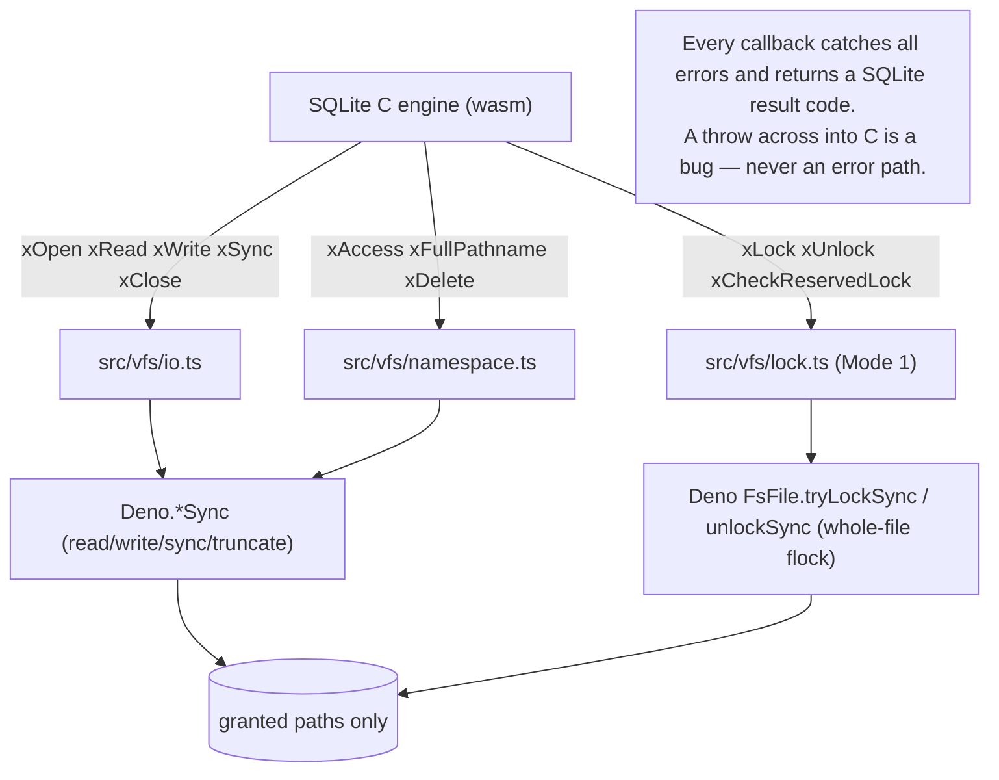
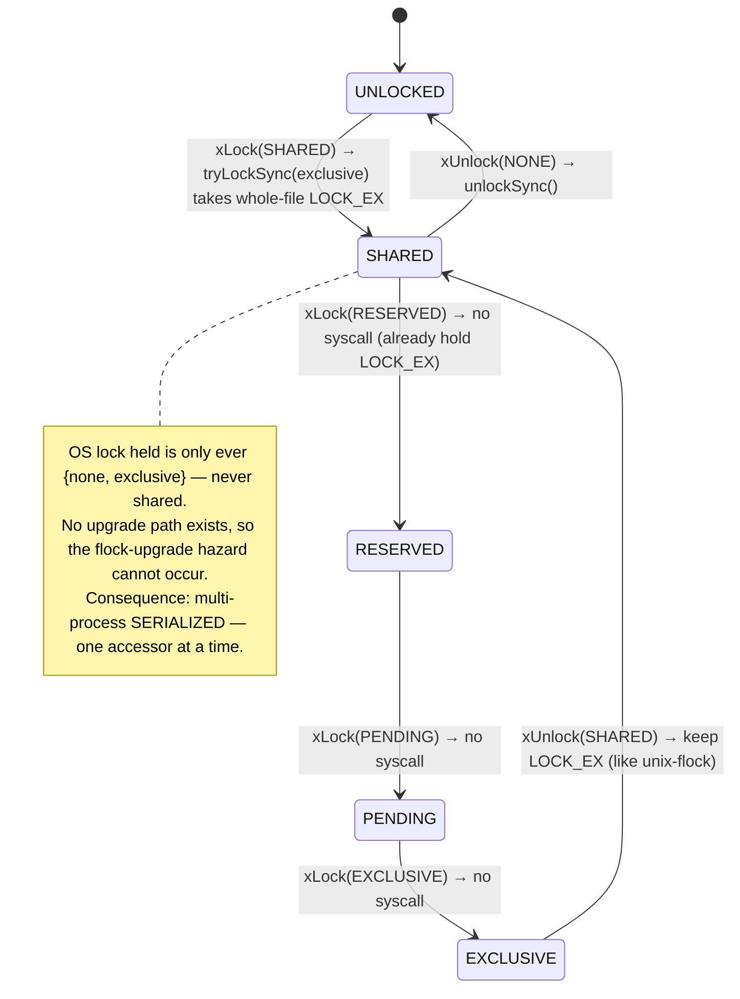
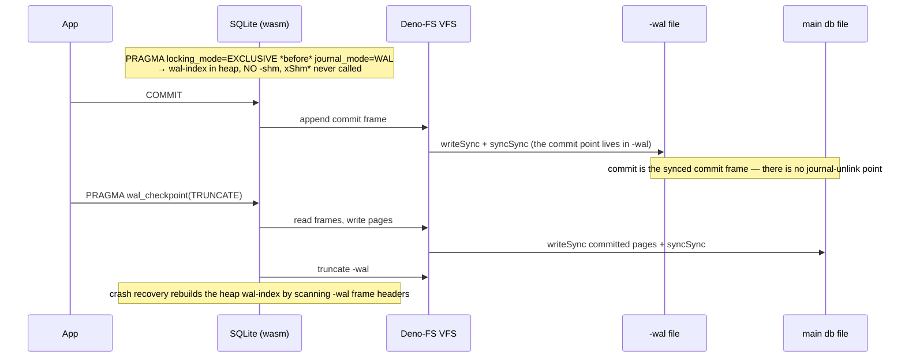

# sqlite-deno

> **A true-Deno SQLite — WASM-based, with zero compromises to Deno's permission model.**
> No FFI. No network. No native modules. No runtime downloads. The same single artifact
> runs everywhere Deno runs, including Deno Deploy and the edge.

This is a **build-in-public** repository. The engine — a pure-TypeScript Deno-filesystem
VFS over the SQLite team's official WebAssembly build, with two concurrency modes and
crash recovery — is built and **proven**. The public API is **not built yet**. Read the
status section before you read anything else.

---

## ⚠️ Status: engine proven, library not yet usable

**Phase 6 of 10 complete.** You **cannot** `import` and open a database from this package
today — there is no `openDatabase`, no `Database`, no `Statement`. That is Phase 7.

What *is* done is the hard part — the part everyone said couldn't be done under Deno's
permission model:

| | |
|---|---|
| **Proven** | The Deno-filesystem VFS (pure TypeScript, over `Deno.*Sync`). Both concurrency modes. Crash / power-loss recovery, on Linux. |
| **Not built** | The public API (`openDatabase`, `Database`, `Statement`, transactions). The reproducible byte-identical wasm build. The JSR release. |
| **Vendored, not yet self-built** | The wasm is the official `@sqlite.org/sqlite-wasm` `3.53.0-build1`, committed in-package (see [`WASM_VENDOR.md`](./WASM_VENDOR.md)). Building our own byte-for-byte from pinned source is Phase 9 and is **0% done**. |

```
v0 — prove the path
  Phase 1  Scaffold & toolchain        ████████████████████  100%  done
  Phase 2  WASM integration spike      ████████████████████  100%  done
  Phase 3  Deno-FS VFS (file-backed)   ████████████████████  100%  done
v1 — public launch
  Phase 4  Crash-sim harness           ████████████████████  100%  done
  Phase 5  Mode 1 — rollback locks     ████████████████████  100%  done
  Phase 6  Mode 2 — WAL (exclusive)    ████████████████████  100%  done
  Phase 7  Public API & bindings       ░░░░░░░░░░░░░░░░░░░░    0%  next
  Phase 8  Full test suite (L1–L6)     ░░░░░░░░░░░░░░░░░░░░    0%
  Phase 9  Reproducible build & CI     ░░░░░░░░░░░░░░░░░░░░    0%
  Phase 10 JSR publish & docs          ░░░░░░░░░░░░░░░░░░░░    0%
v2 — multi-process WAL                 ░░░░░░░░░░░░░░░░░░░░    0%  (gated on Deno core)
```

### How to read this repo right now

```bash
git clone <this-repo> && cd sqlite-deno
deno task check     # fmt, lint, type-check, and the full proof suite (69 tests)
```

- The engine entry points live in [`src/vfs/`](./src/vfs/) — `installDenoVfs` (in
  [`src/vfs/deno.ts`](./src/vfs/deno.ts)) is what registers our VFS against the wasm.
- The exported surface today ([`src/mod.ts`](./src/mod.ts)) is the engine, not a library:
  `loadSqlite3`, `installDenoVfs`, `installMemoryVfs`. You drive SQLite through
  `sqlite3.oo1.DB` after installing the VFS — that is a proving harness, not the intended
  ergonomic API.
- The proofs are in [`test/`](./test/) — the crash and concurrency harnesses under
  [`test/harness/`](./test/harness/) are the most important code in the project.

---

## What it is, and why it exists

Every SQLite option for Deno today forces a compromise:

- **FFI options** (`@db/sqlite`) are fast and full-featured but require `--allow-ffi` —
  which collapses Deno's permission model back to Node-equivalent — download a prebuilt
  `.so` at first run, and **cannot run on Deno Deploy or the edge** (no FFI there).
- **The existing WASM lineage** (`dyedgreen/deno-sqlite`) respects the permission model
  but has no WAL, no file locking, and no shared memory, and is dormant.
- **`node:sqlite`**, built into Deno, works, but it is the Node-shaped API and a native
  engine — not the Deno permission-model story, and not the edge story.

You cannot today get **permission-respecting + WAL + runs-everywhere** in one package.
That is the gap this exists to close.

The bet behind it: Deno's permission model only pays off if the *infrastructure-grade*
packages honor it. A SQLite that is true-Deno with no escape hatches proves the
uncompromised path is real — and becomes the answer to "but Deno can't do real database
work." That is the contribution: not another package, but proof the pattern works for the
hard cases.

**The permission model is the product.** Everything else is in service of it.

---

## The permission story (the differentiator)

The wasm has **no ambient authority**. All of SQLite's I/O flows back out through our VFS
callbacks, and those reach the filesystem only through path-scoped `Deno.*Sync` calls. The
module cannot open a file the host did not hand it. If this package were
supply-chain-compromised tomorrow, its blast radius would still be **exactly** the paths
you granted — no FFI to abuse, no network to phone home, no ambient filesystem.

What the package needs, and nothing more:

```bash
# read-only access to one database file — no --allow-ffi, no --allow-net, no --allow-env
deno run --allow-read=./app.db your_program.ts
```

### The honest durability caveat — read this

The headline "`--allow-read=./app.db` is the entire grant" is true for **reading**. It is
**not** the whole story for **durable writes**:

- A crash-safe commit requires SQLite to `fsync` the **directory** that contains the
  database (so a journal's deletion or a file's creation survives a power cut). Opening a
  directory handle to fsync it is a *read of the directory path*, which a **file-only**
  grant does not cover.
- So **durable** operation needs a read (and write) grant on the **parent directory**:

  ```bash
  # durable writes: grant the directory, not just the file
  deno run --allow-read=./data --allow-write=./data your_program.ts
  ```

- Under a file-only grant the package still works and **fails closed** — it never widens
  your grant — but the directory-fsync is denied, so the last-commit durability guarantee
  is unavailable. We surface this as an error, never as a silent downgrade.

This caveat is tracked as a Phase-7 documentation obligation; the engine behavior is
already correct (fail-closed, never grant-widening).

---

## Architecture

```
┌──────────────────────────────────────────────────────────┐
│  Your code  →  (Phase 7) public API: openDatabase, ...     │  ← not built yet
├──────────────────────────────────────────────────────────┤
│  JS↔WASM glue (src/glue.ts) — marshals values, owns memory │
├──────────────────────────────────────────────────────────┤
│  Official @sqlite.org/sqlite-wasm 3.53.0  (vendored, pinned)│  ← the SQLite engine
├──────────────────────────────────────────────────────────┤
│  Deno-FS VFS (pure TypeScript, src/vfs/*)                  │
│     installed at runtime via sqlite3.vfs.installVfs        │
│     I/O → Deno.openSync / readSync / writeSync / tryLockSync│  ← honors the grant
└──────────────────────────────────────────────────────────┘
```

The key facts:

- **No recompile.** We register a pure-JS VFS against the *prebuilt* official wasm via
  `installVfs` — the same mechanism SQLite's own browser OPFS VFS uses. We add **no C**.
- **The VFS is simpler than the browser's.** OPFS is async but SQLite's VFS is
  synchronous, so the browser VFS needs a `SharedArrayBuffer` + `Atomics.wait` async-proxy
  dance. **Deno's file API is already synchronous**, so our VFS calls Deno I/O directly.
- **Runs on Deno Deploy and the edge** by construction — one wasm, every target, no native
  binaries to build, sign, and re-download.

### VFS dispatch



### The lock ladder (Mode 1, as shipped)

SQLite drives a five-state ladder. Native SQLite implements it with **byte-range** locks at
three independent offsets, which is what lets readers coexist. Deno exposes only
**whole-file** `flock`, so v1 collapses the ladder to SQLite's own `unix-flock` protocol:
take a whole-file `LOCK_EX` for the first lock of *any* level, hold it through the
transaction, release it only at `UNLOCKED`. (Why we did *not* try to be cleverer is in
[The story](#what-we-ran-into-and-decided-the-engineering-story).)



### WAL write / checkpoint (Mode 2, single-process exclusive)



---

## What's proven, and how to verify it yourself

The correctness claims here are **executable**, not asserted. The whole suite runs from a
clean checkout:

```bash
deno task check        # fmt --check, lint, type-check, type-aware lint, full test suite — 69 tests
deno task test:soak    # Mode 1: N real OS processes, Jepsen bank, CPU-oversubscribed (env-gated)
deno task test:soak:wal # Mode 2: multi-seed WAL crash sweep (env-gated)
```

What the suite proves:

- **Crash / power-loss recovery (Linux).** A deterministic fault-injection VFS records every
  write and sync, then a power-loss model reconstructs the disk at each crash point (synced
  data exact; unsynced data dropped, applied, or torn at sector granularity) and reopens
  through the *real* VFS. Invariants checked at every crash point: `integrity_check = ok`,
  committed transactions present, uncommitted absent. A **negative control** (a lying
  no-op `xSync`) is proven to be *caught* — a harness that stays green with durability
  disabled proves nothing. There is also a real `SIGKILL`-mid-write subprocess test.
- **Mode 1 concurrency.** N real OS subprocesses against one shared file, a Jepsen-style
  bank workload (balance-sum conservation, monotonic commit counter, no torn reads,
  periodic `integrity_check`), SIGKILL crash-recovery (exactly one process replays a hot
  journal), and a negative control (no-op locks → corruption detected). Soaked at 36k
  serialized commits under CPU oversubscription.
- **Mode 2 WAL crash recovery.** Crash sweep over the `-wal` op stream: torn-tail recovery
  to a consistent committed prefix, crash-during-checkpoint, salt-advance anti-stale-replay,
  recovery from `{db, -wal}` with the `-shm` deleted (the heap wal-index is rebuilt from
  frame headers — there is no `-shm`). Two negative controls caught.

These run on the **vendored** wasm and the **real** Deno-FS VFS — never a stubbed SQLite.

---

## The honest capability envelope (the asterisks, each with the why)

This is where most projects bury the limitations. We lead with them.

### Mode 1 — rollback journal, multi-process: **serialized**

One accessor at a time. **No concurrent readers.** A reader excludes other readers *and*
writers for as long as it holds the file.

**Why:** Deno's userland exposes only whole-file `flock`, not byte-range `fcntl`. The
obvious "many readers XOR one writer" design (shared locks for readers, upgrade to
exclusive for a writer) is **verified-unsafe** on whole-file `flock`: a Linux `flock`
upgrade is non-atomic — a failed `LOCK_SH → LOCK_EX` upgrade *drops* the shared lock while
returning failure, and SQLite's change-counter revalidation does not fire on the busy-retry
path. That is a real (rare) silent-stale-read / stale-commit corruption window. There is no
event-loop-safe way to close it without byte-range locks. So v1 ships SQLite's own
`unix-flock` protocol verbatim (`LOCK_EX` for every level), which is **provably correct by
construction** — at the cost of serialization. True "many readers XOR one writer" needs
byte-range `fcntl` and is **v2**.

> A contending connection must set a `busy_timeout` so it retries `SQLITE_BUSY` rather than
> failing immediately. All lock calls are non-blocking, so there is no OS deadlock.

### Mode 2 — WAL: **single-process exclusive only**

Real WAL, with the wal-index in heap. **No `-shm` file, no shared-memory methods.** One
process owns the file exclusively.

**Why:** multi-process WAL needs a memory-mapped `-shm` wal-index *and* byte-range `fcntl`
for cross-process coordination — neither available from Deno userland today. Exclusive
locking mode runs WAL with the index in heap, which needs only the whole-file exclusive
lock Deno already has. This is exactly what the official `sqlite-wasm` does, and it covers
the dominant Deno shape: one long-running server process owning its database.
Multi-process WAL is **v2**.

> Setting `journal_mode=WAL` without `locking_mode=EXCLUSIVE` first **fails closed** — SQLite
> returns `"delete"` (no WAL, no crash, no corruption) because the VFS has no shm.

### Durability

- **Directory-fsync is shipped and Linux-proven** (it makes journal creation/deletion
  survive a power cut). It needs the **parent-directory** grant — see
  [the permission caveat](#the-honest-durability-caveat--read-this) above.
- **WAL at `synchronous=NORMAL` is consistency-safe but NOT power-loss-durable for the last
  commit(s).** A transaction that returned `COMMIT` at `NORMAL` can roll back after a power
  cut (it survives an *application* crash, just not a *power* loss). This is documented
  SQLite behavior, not a corruption bug — `integrity_check` stays `ok`. Use
  `synchronous=FULL` for power-loss durability in WAL.
- **Windows** directory-fsync durability is **unverified** (do not rely on it).
  **NFS / networked filesystems are unsupported** — same as native SQLite.
- The crash proofs are model-bounded (a worst-legal-device power-loss model + Linux
  `strace`-verified primitives), **not** real-hardware power-cut testing. A hardware rig is
  a later release-hardening layer.

---

## What we ran into and decided (the engineering story)

The decisions below are the durable record of *why* the thing is built the way it is. The
short version: **no mode ships unproven — "mostly works" is data corruption with extra
steps.** Twice this discipline caught a corruption hole that would otherwise have shipped.

### WASM, not FFI — because the permission model *is* the product

FFI would be faster and easier. It would also require `--allow-ffi` (which collapses Deno's
permission model), download a native binary at first run, and break on Deno Deploy. We
chose WASM with a VFS so the engine has **no ambient authority** and the blast radius is
exactly the granted paths. This is the central trade: we give up some write throughput and
win the permission model, the edge, and a verifiable supply chain. We say so plainly in the
matrix below.

### A pure-TypeScript VFS — no recompile, edge-compatible

Rather than fork a lineage or compile our own wasm, we consume the official
`@sqlite.org/sqlite-wasm` and register a VFS against it in pure TypeScript via `installVfs`.
v1 carries **no C toolchain** — the package is auditable TypeScript over a pinned wasm blob.
(We did *not* fork `@db/sqlite`, whose entire architecture is FFI-first, nor the `dyedgreen`
lineage, which predates the official wasm and was built when WAL was deemed impossible.)

### The crash harness as a gate — built *before* locking and WAL

The highest-leverage code in the project is a deterministic crash-simulation VFS, built
*before* any locking or WAL so every later mode is provable. A locking or WAL mode is
exposed only after its crash + concurrency harness is green, with a mandatory **negative
control** proving the harness has teeth. This is non-negotiable: a red harness means the
mode is single-process-only or unshipped — never "ship it and watch."

### BUG-001 — the crash harness found *silent* committed-data loss, and the first fix was wrong

The harness found that in DELETE journal mode a committed transaction could be **silently
lost** (`integrity_check` still `ok`!) after a power cut: a "zombie" hot journal reappears
and SQLite rolls the committed pages back. The first diagnosed root cause — *"Deno cannot
fsync a directory"* — was **wrong**. A 30-second `strace` probe showed
`Deno.openSync(dir).syncSync()` *is* a directory fsync (`openat` + `fsync`); the VFS simply
wasn't issuing it. The real fixes: default to `journal_mode=PERSIST` (durable via
file-content fsync, no directory round-trip) **and** issue the directory fsync in the VFS
where SQLite expects it. Both are harness-proven on Linux. The lesson: verify the root cause
against the artifact before designing around it.

### The X-strict pivot — we *retreated* from an unproven concurrent-reader design

The first Mode-1 draft was the clever "many readers XOR one writer" design. Verifying it
against the pinned SQLite source (`os_unix.c`, `pager.c`) and probing Linux `flock` revealed
the non-atomic-upgrade corruption hazard described above — and that the SQLite revalidation
we were counting on to save us **does not fire** on the relevant path. Rather than ship an
unproven concurrency win, we *retreated* to the provably-safe serialized design (SQLite's
own `unix-flock` protocol) and deferred concurrent readers to v2. Shipping less, proven,
beat shipping more, unproven.

---

## Honest comparison matrix

A fair read of where this sits. We lose on raw write throughput; we win or draw elsewhere.
We do not strawman the alternatives — each is a reasonable choice for a different problem.

| | **sqlite-deno** (this) | `@db/sqlite` (FFI) | `node:sqlite` (built-in) | `dyedgreen/deno-sqlite` (WASM) | `@sqlite.org/sqlite-wasm` (official) |
|---|---|---|---|---|---|
| Engine | WASM (official) | native (FFI) | native (built into Deno) | WASM (own build) | WASM (official) |
| Permission grant | `--allow-read`/`-write` only | **needs `--allow-ffi`** | engine is native; not the Deno permission story | `--allow-read`/`-write` only | read of wasm only (browser-first) |
| Runtime download | none (in-package) | **downloads a `.so` at first run** | none (in Deno) | none | none |
| Runs on Deno Deploy / edge | **yes** | **no** (no FFI) | yes | yes | designed for the browser, not Deno FS |
| WAL | **yes** (single-process, v1) | yes (full) | yes (native) | **no** | yes (browser/OPFS) |
| Multi-process | yes — **serialized** (v1); full WAL in v2 | yes (full byte-range) | yes (native) | yes (rollback, readers-XOR-writer) | n/a (browser) |
| Bulk-write throughput | slower (WASM) — **we lose here** | **fastest** | fast (native) | slower (WASM) | slower (WASM) |
| Reproducible build / provenance | **planned** (Phase 9–10, OIDC) — vendored today | binary from a release | ships with Deno | own build | npm-published |
| Deno-filesystem VFS | **yes** (pure TS) | n/a (native) | n/a (native) | yes | no (OPFS-oriented) |
| **Usable as a library today** | **NO — engine only, API is Phase 7** | yes | yes | yes | yes (browser) |

Take-away: if you need maximum bulk-write speed and `--allow-ffi` is acceptable, use
`@db/sqlite`. If you need an embedded SQLite that **keeps Deno's permission model intact and
runs on the edge**, that is the gap this fills — once Phase 7 lands.

---

## Roadmap

**v1 (public launch):**

- **Phase 7 — Public API.** `openDatabase`, `Database`, typed `Statement<Row>`,
  transactions, `using`/`Symbol.dispose` lifetimes, Web-Streams result streaming. Mode
  selection is explicit and constrained at open (illegal combos unrepresentable), so a
  caller cannot accidentally leave the proven engine envelope. No user-defined SQL functions
  in v1 (that JS-callback-reentrancy surface is exactly where native engines have hit
  use-after-free; it waits until the reentrancy model is proven).
- **Phase 8 — Full L1–L6 test suite** (functional, permission, crash/durability,
  concurrency, borrowed SQLite/fuzz corpora, build).
- **Phase 9 — Reproducible byte-identical wasm build.** Today the wasm is the **vendored**
  official artifact; compiling our own byte-for-byte from pinned SQLite source + pinned
  toolchain, with a `verify-build.sh` a stranger can run, is **not done**.
- **Phase 10 — JSR publish** with OIDC provenance, immutable versions, API reference.

**v2 — multi-process WAL.** Gated on contributing byte-range `fcntl(F_OFD_SETLK)` locking to
Deno core (`ext/io/fs.rs`) and exposing mmap for a real `-shm`. With those, Mode 1 gets the
faithful three-byte-range ladder (true concurrent readers) and WAL goes multi-process. This
is a self-contained, on-mission Deno-core contribution — and a forcing function on the
runtime.

---

## Running the gate / contributing

```bash
deno task check        # the gate: fmt --check, lint, type-check, type-aware lint, test
deno task test         # full suite
deno task test:soak    # Mode 1 multi-process soak (SQLITE_DENO_SOAK=1, CPU-oversubscribed)
deno task test:soak:wal # Mode 2 WAL crash-sweep soak
deno task bench        # hot-path measurement
```

Every change must keep the gate green — zero failures, zero lint warnings, zero
suppressions. The non-negotiable rule: **no concurrency or durability mode is exposed until
its crash/concurrency harness is green, including its negative control.** The permission
model is the product; no change may require a grant beyond `--allow-read`/`--allow-write` on
the target database, and no code path may acquire a permission the caller did not pass in.

The toolchain is entirely Deno's built-ins (`deno check` / `lint` / `fmt` / `test` /
`bench`) plus a pinned, checksum-verified Biome for type-aware lint (dev/CI only — never
shipped).

---

## License

[MIT](./LICENSE) © 2026 ul0gic. Do whatever you want with it.
